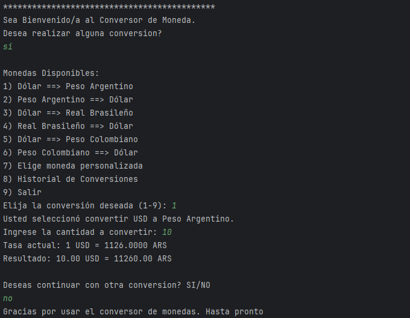

# Conversor-De-Monedas

## Descripción

Este proyecto es un **conversor de monedas** que permite a los usuarios convertir una moneda a otra usando tasas de cambio actuales obtenidas de una API externa. El programa proporciona una interfaz en consola, donde el usuario puede elegir la conversión que desea realizar, ingresar la cantidad de dinero a convertir y ver el resultado con la tasa de cambio actualizada.

Además, se implementa la capacidad de rastrear un historial de conversiones y guardarlo en un archivo JSON, proporcionando al usuario la opción de revisar conversiones anteriores.

## Características

- Conversión entre varias monedas (Dólar, Peso Argentino, Real Brasileño, Peso Colombiano, etc.).
- Opción para convertir monedas personalizadas ingresando los códigos de moneda.
- Historial de conversiones guardado en un archivo `historial.json`.
- Interfaz sencilla en consola.
- Consultas de tasas de cambio actuales a través de una API externa.

## Tecnologías

- **Java 11+**.
- **Gson 2.11.0** para trabajar con JSON.
- **API externa de tasas de cambio** (https://v6.exchangerate-api.com).

## Instalación

1. **Clonar el repositorio**:

   ```bash
   git clone https://github.com/Cesar-ESR/Conversor-De-Monedas.git
   cd conversor-monedas

2. **Ejemplo de flujo de usuario**:



3. **Funcionalidades Avanzadas.**:
   * Conversión personalizada: El usuario puede ingresar los códigos de moneda para realizar conversiones personalizadas.
   * Historial de conversiones: Se guarda un historial de todas las conversiones realizadas durante la sesión, y este se guarda en un archivo historial.json.
   * Consultar historial: Al seleccionar la opción de historial, el usuario puede ver todas las conversiones realizadas durante la sesión.
